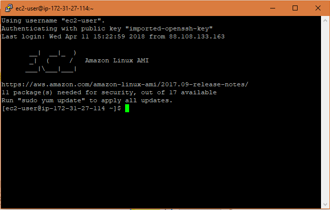
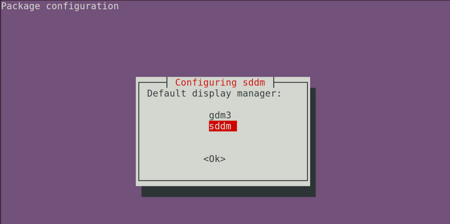

# Description
This package contains scripts and executables needed for you to access/control a remote computer via a desktop Graphic User Interface (GUI).  Normally an Amazon Web Service (AWS) like EC2 will only provide a terminal with no graphical desktop environment.  

These scripts will transform your basic terminal into a full fledge desktop environment.

The script will perform the following processes.

1. Setup a virtual desktop environment on the server.
2. Setup a forwarding server that will broadcast to clients.
3. Setup a client that can interact with the server.
4. Setup a secure (SSH) transport layer between server and client.

# Install
## Server
* Run: 
  > python setup-server.py

* During the installation process a screen will pop up asking what display manager you want to use.  Select `sddm`.

## Client
* Download and install TigerVNC from [here](https://github.com/TigerVNC/tigervnc/releases). (Or install TigerVNC included in this package.)
  
* Place TigerVNC app in the `~/Applications/` folder.

* Install [homebrew](https://brew.sh) on your client (local machine).

* Modify the `setup-client.py` variables to match your configuration settings.
  
* Run 
  > python setup-client.py

# Use
After the installation completes, run the alias from the client terminal:

* > vnc-devbox  # default alias (user configurable)

# Terms:

* client: your local computer
* server: the remote computer 
* VNC: Virtual Network Computing