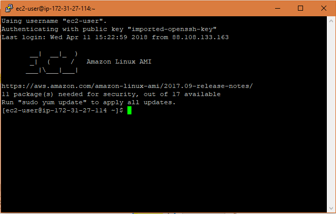
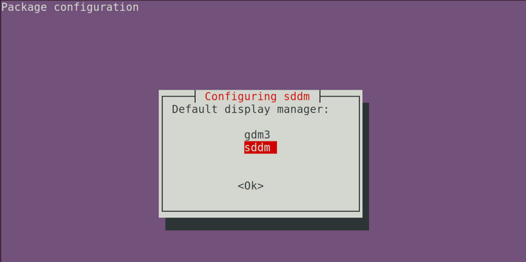
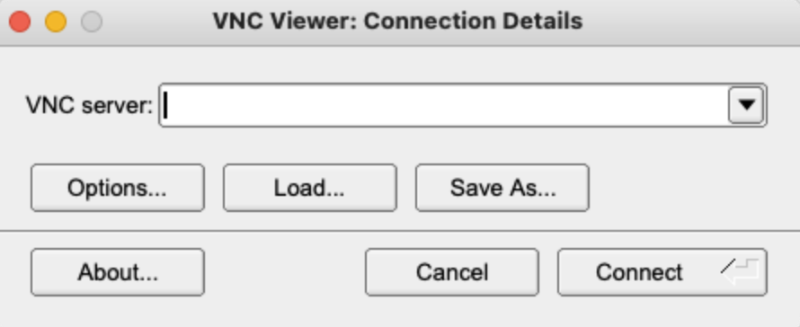
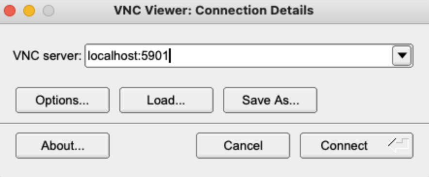

# Description
This package contains scripts and executables needed for you to access/control a remote computer via a desktop Graphic User Interface (GUI).  Most development servers are terminal based without screen forwarding capabilities.  This presents a problem if the user needs to use GUI based applications on the remote server.  This repo provides code and instructions on how to setup a proper screen forwarding solution between host and clients.

### Author: William Li
### Version: 1.0.0
---

<figure>
    <p align="center">
    
    </p>
  <figcaption align = "center"><b>Fig.1 - Typical host terminal.</b></figcaption>
</figure>

<figure>
    <p align="center">
    
    </p>
  <figcaption align = "center"><b>Fig.2 - A beautiful GUI based OS.</b></figcaption>
</figure>

### The script will perform the following processes.
---

1. Setup a virtual desktop environment on the server.
2. Setup a forwarding server that will broadcast displays to clients.
3. Setup a client that can interact with the server over SSH.

# Installation
## Server Instructions
1.) Run the **setup-server.py** script.
```bash
$ python setup-server.py
```

<figure>
    <p align="center">
    
    </p>
  <figcaption align = "center"><b>Fig.3 - During the installation process a screen will pop up asking what display manager you want to use.  Select `sddm`.</b></figcaption>
</figure>


>Note: You will be asked to setup a login password.  This is not your username login password.  Rather it is a password to log into the viewer for Tiger VNC.  As a default you can enter `ubunutu`.
## Client Instructions

> Note: Install [Homebrew](https://brew.sh) on your client (local machine) if you do not already have it!
> 
1) Download and install the [TigerVNC](https://github.com/TigerVNC/tigervnc/releases) binary (not the source code!).
2) Place **TigerVNC** app in the **~/Applications/** folder.  
3) Remember to allow access by opening it with **Ctrl-Click**.

<figure>
    <p align="center">
    
    </p>
  <figcaption align = "center"><b>Fig.4 - Select Open.</b></figcaption>
</figure>


<figure>
    <p align="center">
    
    </p>
  <figcaption align = "center"><b>Fig.5 - You will see this window if it successfully opens.</b></figcaption>
</figure>


1) Modify the **`setup-client.py`** variables to match your configuration settings.

  ```python
  # ------------------------------------------------------------------
  # FILL OUT PRIOR TO RUNNING THE SCRIPT!
  # ------------------------------------------------------------------
  # setup required
  SERVER_USER = "ubuntu"  # enter your userid here
  SERVER_IP = "xxx.xx.xx.xx"  # the address to the server
  SERVER_LOCAL = "127.0.0.1"  # leave this as default to use localhost
  CUSTOM_ALIAS = "vnc-devbox"  # the custom alias you want for connecting
  ```
  
5) Run **setup-client.py**
  ```bash
  $ python setup-client.py
  ```

# Use
After the installation completes, you will be provided an alias called **vnc-devbox** that is added to your **.bashrc** and **.zshrc** startup files.

```bash
alias vnc-devbox="ssh -L {TIGERVNC_PORT}:{SERVER_LOCAL}:{TIGERVNC_PORT} {SERVER_LOGIN}" # Sets up **SSH** between the local client and the host.
```

1) Execute the alias command.
```bash
$ vnc-devbox # opens a SSH terminal to the host
```

2) Startup a session on the host.
```bash
$ vncserver # will use the settings in ~/.vnc/xstartup

> New Xtigervnc server '<hostname>:1 (userid)' on port 5901 for display :1.
> Use xtigervncviewer -SecurityTypes VncAuth -passwd /home/userid/.vnc/passwd :1 to connect to the VNC server.
```

3) You will see a TigerVNC session up after success.
```bash
$ vncserver -list

TigerVNC server sessions:

X DISPLAY #	RFB PORT #	RFB UNIX PATH	PROCESS ID #	SERVER
1         	5901      	             	3423510     	Xtigervnc
```

5) If you execute a tunnel via the alias command then startup the client TigerVNC app and enter the following address:

<figure>
    <p align="center">
    
    </p>
  <figcaption align = "center"><b>Fig.6 - The reason we are entering the address as localhost:5901 is because the SSH command has bounded the host address to that local address.</b></figcaption>
</figure>

<figure>
    <p align="center">
    
    </p>
  <figcaption align = "center"><b>Fig.7 - You need to enter your standard user password to log into the computer.</b></figcaption>
</figure>

# Troubleshooting
To kill the sessions log into the server and execute:
```bash
vncserver -kill :*
```

If you have trouble with the display check the xstartup script.  You may need to modify the script use a display that is compatible with your host and client.

```bash
#!/bin/sh
 unset SESSION_MANAGER
 unset DBUS_SESSION_BUS_ADDRESS
 #startkde &
 startplasma-x11
 
 
 [ -x /etc/vnc/startplasma-x11 ] && exec /etc/vnc/startplasma-x11
 [ -r $HOME/.Xresources ] && xrdb $HOME/.Xresources
 xsetroot -solid grey
 vncconfig -iconic &
 ```

 If you need access to the Snap Store:
 ```bash
 # Setup Snap Store
 snap set system proxy.http="<proxy_address>"
 snap set system proxy.https="<proxy_address>"
 ```

 If you have trouble opening Firefox make sure Xauthority is set:
 ```bash
export XAUTHORITY=$HOME/.Xauthority
 ```

If you need a proxy for the wget configuration file at `/etc/wgetrc`.
```bash
 # You can set the default proxies for Wget to use for http, https, and ftp.
 # They will override the value in the environment.
 https_proxy = <proxy address>
 http_proxy = <proxy address>
 ftp_proxy = <proxy address>
 
 # If you do not want to use proxy at all, set this to off.
 use_proxy = on
 ```